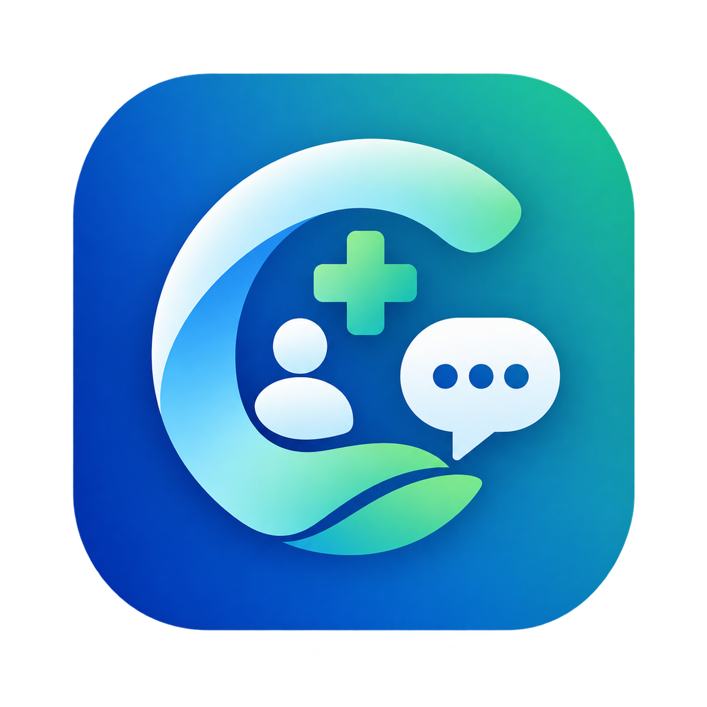
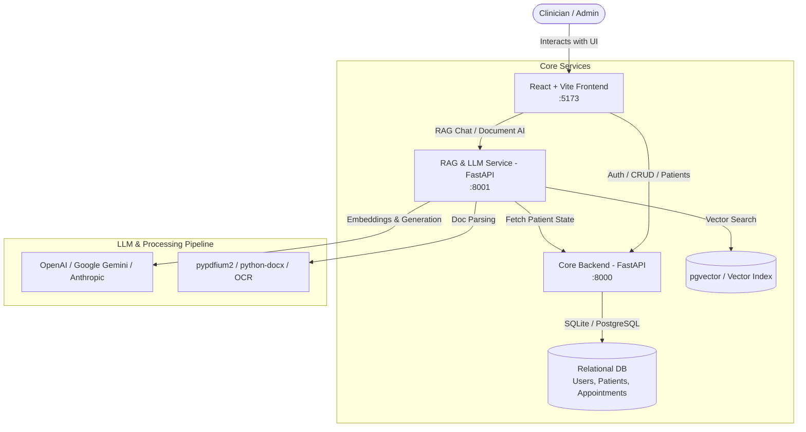

# 🏥 CuraMind — Clinical AI Assistant & Medical Intelligence Platform

<p align="center">
  
</p>

<p align="center">
  <strong>Empowering clinicians to navigate complex medical charts, unstructured patient records, and clinical workflows in seconds with grounded, citation-backed AI.</strong>
</p>

<p align="center">
  <a href="#-key-features">Key Features</a> •
  <a href="#-system-architecture">Architecture</a> •
  <a href="#-tech-stack">Tech Stack</a> •
  <a href="#-project-structure">Project Structure</a> •
  <a href="#-quickstart-guide">Quickstart Guide</a> •
  <a href="#-api-reference">API Reference</a> •
  <a href="#-testing">Testing</a> •
  <a href="#-clinical-safety--disclaimer">Safety & Disclaimer</a>
</p>

---

## 🌟 Overview

**CuraMind** is an enterprise-grade Clinical AI Assistant and Retrieval-Augmented Generation (RAG) platform tailored for healthcare professionals. Medical charts, scanned lab reports, discharge summaries, and consultation notes are often scattered across disconnected formats. 

CuraMind bridges this gap by offering:
- **Instant Document Intelligence:** Parse, index, and query unstructured clinical documents with exact source-page citations.
- **App-Level Workspace Intelligence:** Query application state in natural language (e.g., *"How many patients are admitted?"*, *"List today's appointments"*, *"Show discharged cardiac patients"*).
- **Clinical Safeguards:** Zero unverified guessing—built-in guardrails ensure the assistant admits when data is absent rather than hallucinating clinical facts.

---

## ✨ Key Features

### 1. 🛡️ Clinically Grounded RAG with Traceable Citations
- **Strict Grounding:** Every generated answer is anchored to ingested medical documents with exact document names, section references, and page numbers.
- **Hallucination Prevention:** When information is absent from a patient's chart, CuraMind explicitly flags that data as unavailable.
- **Clinical Guardrails:** Distinguishes between clinical value-seeking questions (vital signs, lab dosages, diagnoses) and general app queries, ensuring accurate document retrieval.

### 2. 🧠 Workspace Intelligence Layer
- **Conversational App Querying:** Ask questions about high-level patient rosters, admission stats, discharge counts, and appointment schedules.
- **Hybrid Semantic + Exact Matching:** Supports natural language synonym resolution (*e.g., "high blood pressure" ↔ "hypertension"*) alongside exact patient ID and MRN key lookups.

### 3. 📄 Clinical Document Ingestion & OCR
- **Multi-Format Ingestion:** Seamlessly processes PDF, DOCX, and scanned medical records using `pypdfium2`, `python-docx`, and OCR pipelines.
- **Intelligent Chunking:** Semantic text chunking designed around clinical notes (Chief Complaint, History of Present Illness, Assessment & Plan, Lab Panels).

### 4. ⚖️ Longitudinal Document Comparison
- **Side-by-Side Analysis:** Compare medical records over time (e.g., initial admission note vs. discharge summary).
- **Structured Field Diffs:** Automatically extracts and tracks changes across vitals, medications, diagnoses, and lab results.

### 5. 👥 Multi-Tenant Workspaces & RBAC
- Role-Based Access Control (**Admin**, **Clinician**, **Auditor**).
- JWT-based authentication with Argon2 password hashing.
- Comprehensive audit trails for HIPAA/compliance readiness.

---

## 🏗️ System Architecture



---

## 💻 Tech Stack

| Layer | Technologies |
|---|---|
| **Frontend** | React 18, Vite, React Router v7, Modern CSS Design System (Glassmorphism, Dark/Light palettes) |
| **Core Backend** | Python 3.10+, FastAPI, SQLAlchemy 2.0, Alembic, SQLite / PostgreSQL, PyJWT, Argon2 |
| **RAG & AI Service** | FastAPI, LangChain Core/Community, `pgvector`, `tiktoken`, `pypdfium2`, `python-docx` |
| **LLM Support** | OpenAI (GPT-4o, GPT-3.5), Google Gemini (Gemini 1.5/2.0), Anthropic Claude 3.5 |
| **Testing** | Pytest, AnyIO, HTTPX |

---

## 📁 Project Structure

```
CuraMind App/
├── backend/                  # Core FastAPI backend (Auth, Patients, Appointments, DB)
│   ├── alembic/              # Database migration scripts
│   ├── app/
│   │   ├── api/              # API router endpoints
│   │   ├── controllers/      # Business logic handlers
│   │   ├── core/             # Security, config, and JWT handlers
│   │   ├── db/               # Database session and base models
│   │   ├── models/           # SQLAlchemy ORM models
│   │   └── schemas/          # Pydantic validation schemas
│   ├── tests/                # Backend test suite
│   └── requirements.txt      # Backend dependencies
│
├── rag-service/              # RAG, LLM Assistant & Document AI Microservice
│   ├── app/
│   │   ├── controllers/      # RAG & Assistant route controllers
│   │   ├── db/               # pgvector database connections
│   │   ├── schemas/          # RAG request/response schemas
│   │   └── services/         # Core AI Services
│   │       ├── comparison.py            # Document diff & change extraction
│   │       ├── embeddings.py            # Vector embedding generator
│   │       ├── ingestion.py             # Document parser & chunker
│   │       ├── llm.py                   # Multi-provider LLM connector
│   │       ├── rag_assistant.py         # Main grounded RAG pipeline
│   │       ├── retrieval.py             # Hybrid vector + keyword retrieval
│   │       └── workspace_intelligence.py# App data semantic interpreter
│   ├── tests/                # RAG service test suite
│   └── requirements.txt      # RAG service dependencies
│
├── frontend/                 # React + Vite Single Page Application
│   ├── src/
│   │   ├── components/       # Reusable UI widgets, Navbars, Sidebars
│   │   ├── context/          # Auth & App state providers
│   │   ├── pages/            # Dashboard, Ask (Chat), Compare, Documents, Patients
│   │   └── styles/           # Design tokens, themes & layout styles
│   └── package.json          # Frontend scripts and dependencies
│
└── README.md                 # Project documentation
```

---

## 🚀 Quickstart Guide

### 1. Prerequisites
- **Python 3.10+**
- **Node.js 18+** & `npm`
- **PostgreSQL with pgvector** (or SQLite for development/testing)

---

### 2. Backend Setup (Port 8000)

```bash
cd backend

# Create and activate a virtual environment
python3 -m venv .venv
source .venv/bin/activate  # On Windows: .venv\Scripts\activate

# Install dependencies
pip install -r requirements.txt

# Configure environment variables
cp .env.example .env

# Run database migrations
alembic upgrade head

# Start backend server
uvicorn app.main:app --port 8000 --reload
```

---

### 3. RAG & AI Service Setup (Port 8001)

```bash
cd rag-service

# Create and activate virtual environment
python3 -m venv .venv
source .venv/bin/activate  # On Windows: .venv\Scripts\activate

# Install dependencies
pip install -r requirements.txt

# Configure environment variables (Add your OpenAI/Gemini/Anthropic API keys)
cp .env.example .env

# Start RAG service
uvicorn app.main:app --port 8001 --reload
```

---

### 4. Frontend Setup (Port 5173)

```bash
cd frontend

# Install dependencies
npm install

# Start Vite development server
npm run dev
```

Visit **`http://localhost:5173`** in your browser.

---

## 🧪 Testing

### Run Backend Tests:
```bash
cd backend
pytest tests/ -v
```

### Run RAG Service Tests:
```bash
cd rag-service
pytest tests/ -v
```

---

## 📡 API Reference Overview

### Backend (`http://localhost:8000/docs`)
- `POST /api/v1/auth/login` — User authentication and JWT generation.
- `GET /api/v1/patients` — List all registered patients.
- `POST /api/v1/patients` — Create new patient record.
- `GET /api/v1/appointments` — Schedule and retrieve appointments.

### RAG Service (`http://localhost:8001/docs`)
- `POST /api/v1/rag/query` — Grounded RAG query against indexed patient documents.
- `POST /api/v1/assistant/chat` — Conversational assistant query (supports app-level intelligence & document RAG).
- `POST /api/v1/documents/ingest` — Upload and index clinical PDF/DOCX files into vector storage.
- `POST /api/v1/documents/compare` — Compare two clinical documents with structured diffs.

---

## 🛡️ Clinical Safety & Disclaimer

> [!IMPORTANT]
> **Clinical AI Decision Support Notice**  
> CuraMind is intended as an assistive productivity tool for qualified healthcare personnel. It **does not** provide autonomous medical diagnoses, treatment prescriptions, or definitive medical directives. All generated summaries, extracted parameters, and responses must be validated by a licensed medical professional before taking clinical actions.

---

## 📄 License

This project is licensed under the MIT License — see the [LICENSE](LICENSE) file for details.
